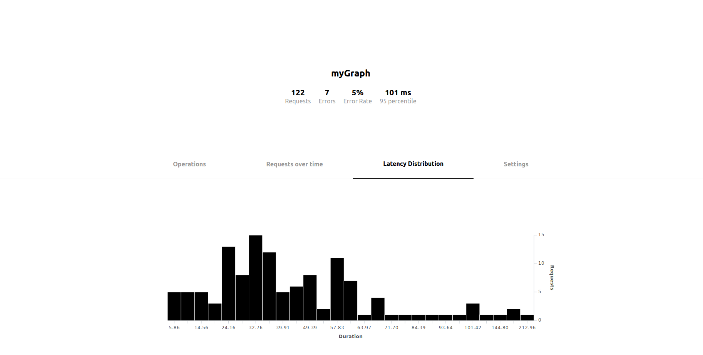
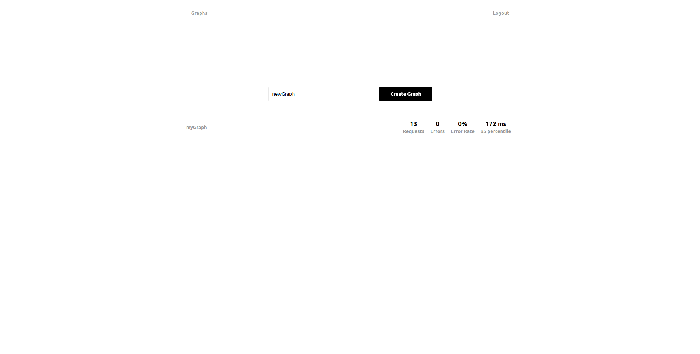

# Clementine 🍊

> A self-hosted Graphql Analytics and Observability Platform

Most analytics tools don't work well for graphql because they are tuned for standard REST based services. Clementine aims to provide a simple way to understand the performance of your graphql server. Allowing you to quickly find your slowest queries and bottleneck resolvers. Its simple to install and has drop in support for graphql servers that support [Apollo Tracing format](https://github.com/apollographql/apollo-tracing).

**Note**: Clementine only implements a subset of [Apollo Graph Manager](https://www.apollographql.com/docs/graph-manager/) features, if you can afford it you should just use their service.

Warning! Clementine is still alpha software. You can try on the [demo](https://clementine.hobochild.com). But you should really run your own instance if you care about uptime or reliability.

- [Features](#features)
- [Running an instance](#running-an-instance)
- [Getting Started](#getting-started)
- [RoadMap](#road-map)

### Features

<details>
<summary>
Find Operations by Popularity, Latency, Error count and Error rate.</summary>

</details>

<details>
<summary>Requests and operations over time.</summary>

</details>

<details>
<summary>Latency distribution of all requests or specific operations.</summary>

</details>

<details>
<summary>Global Filters.</summary>

</details>

<details>
<summary>Resolver level timings of for each Trace.</summary>

</details>

### Running an instance

Add all required environment variables in `.env`.

Then for development:

```
make dev
```

Then visit http://localhost:80

Or for production:

```
make start
```

Or for production with letsEncrypt

```
make start_with_ssl
```

### Getting Started

First thing we need to do is create a graph and an ApiKey so you can start storing traces from your graphql server.

##### Create a graph

Once you have a clementine instance running. Login in through the dashboard and create a new graph.



Then navigate to the graphs settings page and create an apiKey.


We only store a hash of the key so make sure you copy it down.

##### Configure your server

Now configure your server to send traces to clementine.

This is what it looks like with ApolloServer:

```javascript
const { ApolloServer } = require('apollo-server')

const server = new ApolloServer({
  typeDefs,
  resolvers,
  engine: {
    apiKey: '<YOUR-API-KEY-HERE>',
    endpointUrl: 'https://<YOUR-CLEMENTINE-HOST>'
  }
})

server.listen().then(({ url }) => {
  console.log(`🚀 Server ready at ${url}`)
})
```

Now run some queries and the them populate in the clementine dashboard.


##### Forwarding traces to Apollo Graph Manager.

If are trailing clementine and want to forward your traces to Apollo you can pass both the apolloKey and the clementineKey seperated by a `?`. For example:

```javascript
const { ApolloServer } = require('apollo-server')

const server = new ApolloServer({
  typeDefs,
  resolvers,
  engine: {
    apiKey: '<YOUR-CLEMENTINE-API-KEY-HERE>?<YOUR-APOLLO-API-KEY>',
    endpointUrl: 'https://<YOUR-CLEMENTINE-HOST>'
  }
})

server.listen().then(({ url }) => {
  console.log(`🚀 Server ready at ${url}`)
})
```

### Road Map

- Team/Org support.
- Add error distribution views.
- helm chart
